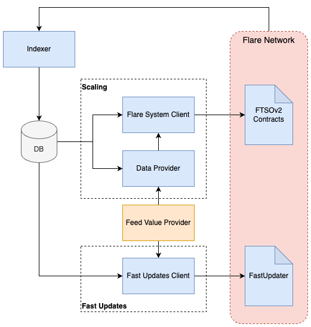

# ftso-v2-provider-deployment

## FTSOV2 Overview



A data provider system for FTSOv2 consists of the following components:

1. **Flare System Client**. Responsible for all interactions with the FTSOv2 smart contracts, including data collection and submission, voter registration, and additional system tasks.
2. **Data Provider**. Provides commit, reveal, and median result data to System Client for submission.
3. **Feed Value Provider**. Provides current values (prices) for a given set of feeds.
4. **Indexer**. Monitors the blockchain and records all FTSOv2 related transactions and events.
5. **Fast Updates Client**. Responsible for interaction with Fast Updates contracts, including data collection and submission and other system tasks.

Reference implementations are provided for **Indexer**, **Flare System Client**, **Data Provider**, **Fast Updats Client**, and providers are expected to plug in their own **Feed Value Provider** implementing a specific REST API (there is an sample implementation for testing).

### Operation

The following is a very simplified description of a single voting round operation.

**System Client** runs a scheduler which triggers voting actions every round (90s):
- On voting round start, obtain reveal data for the previous round from **Data Provider** and send to `Submission` smart contract.
- Once the reveal deadline passes (45s), obtain median result Merkle root from **Data Provider**, sign, and send to `Submission` smart contract. 
- Before the end of the voting round, obtain a feed value commit hash for the current round from the **Data Provider** (which will get processed in the following round).
- There is finalizer process which monitors the indexer database for signature transactions, and once enough signature weight for a voting round is gathered, submits the set of signatures to the `Relay` smart contract. If signature verification passes, the voting round is considered finalized. The `Relay` contract is the authoritative storage of confirmed voting round result Merkle roots.

Additionally, once in a reward epoch the **System Client** triggers voter registration, which allows participating in the following reward epoch.

**Data Provider** obtains all commit and reveal data straight from encoded transaction calldata recorded in the indexer database. All calls to `Submission` contract are simply empty function invocations, with the actual submission data provided as additional calldata on the transaction.

## Deployment

### Entity registration

You will need to setup your Entity by following [REGISTRATION.md](docs/REGISTRATION.md).

### Dependencies

You will also need to install some dependencies on your system:
- [jq](https://jqlang.github.io/jq/)
- [envsubst](https://www.gnu.org/software/gettext/manual/html_node/envsubst-Invocation.html)
- [docker](https://www.docker.com/)
- [bash] (macOs only for updated version) `brew install bash`

### Stack deployment
Use `.env.example` to create `.env` file (eg.: using `cp .env.example .env`) and fill out all values.

Populate configs for provider stack by running `./populate_config.sh`. **NOTE: You'll need to rerun this command if you change your `.env` file.**

Since docker-compose.yaml is provided you can start everything with `docker compose up -d` and stop everything with `docker compose down`. Database is persisted in a named docker volume. If you need to wipe database you need to remove the volume manually. When upstream codebase is changed new images need to be pulled with `docker compose pull`.

### Feed value provider

Start your own feed value provider or alternatively use example provider:
```bash
docker run --rm -it \
  --publish "0.0.0.0:3101:3101" \
  --network "ftso-v2-deployment_default" \
  ghcr.io/flare-foundation/ftso-v2-example-value-provider
```

Once the container is running, you can find the API spec at: http://localhost:3101/api-doc.

Note: some users reported issues with getting the provider to start. For initial testing a "fixed" value provider can be used that simply returns a constant instead of reading data from exchanges. It can be started by setting an extra env variable `VALUE_PROVIDER_IMPL=fixed`:
```bash
docker run --rm -it \
  --env VALUE_PROVIDER_IMPL=fixed \
  --publish "0.0.0.0:3101:3101" \
  --network "ftso-v2-deployment_default" \
  ghcr.io/flare-foundation/ftso-v2-example-value-provider
```

You should see the following in the logs:
```
WARN [FixedFeed] Initializing FixedFeed, will return 0.01 for all feeds.
```

### How do I know it's working

You will see various errors initially on `ftso-scaling` and `flare-system-client`, since the data provider will not be registered as a voter for the current reward epoch. There is a time window for voter registration on every reward epoch, and if you leave things running you should eventually see `RegisterVoter success` logged by `flare-system-client`. It should then start submitting data successfully in the *following* reward epoch.

Here are log samples indicating successful operation (`flare-system-client`):
```
[03-04|06:58:20.000]	DEBUG	protocol/submitter.go:142	submitter submit1 running epoch 567838
[03-04|06:58:20.000]	DEBUG	protocol/submitter.go:143	  epoch is [2024-03-04 06:57:00 +0000 UTC, 2024-03-04 06:58:30 +0000 UTC], now is 2024-03-04 06:58:20.000923016 +0000 UTC m=+234317.457953448
[03-04|06:58:20.001]	DEBUG	protocol/protocol_utils.go:55	Calling protocol client API: http://ftso-scaling-00:3100/submit1/567838/0x5579C824e5550ae24ceFe41B129472c3EC70be5c
[03-04|06:58:20.081]	DEBUG	chain/tx_utils.go:120	Sending signed tx: 0xd4e677859190afca0c5f287e735b959ced12d8f5107bcb14cc31add09cbc92ec
[03-04|06:58:20.212]	DEBUG	chain/tx_utils.go:128	Waiting for tx to be mined...
[03-04|06:58:22.244]	DEBUG	chain/tx_utils.go:134	Tx mined, getting receipt 0xd4e677859190afca0c5f287e735b959ced12d8f5107bcb14cc31add09cbc92ec
[03-04|06:58:22.271]	DEBUG	chain/tx_utils.go:139	Receipt status: 1
[03-04|06:58:22.272]	INFO	protocol/submitter.go:78	submitter submit1 submitted tx
[03-04|06:58:35.001]	DEBUG	protocol/submitter.go:142	submitter submit2 running epoch 567839
[03-04|06:58:35.001]	DEBUG	protocol/submitter.go:143	  epoch is [2024-03-04 06:58:30 +0000 UTC, 2024-03-04 07:00:00 +0000 UTC], now is 2024-03-04 06:58:35.001392224 +0000 UTC m=+234332.458422666
[03-04|06:58:35.001]	DEBUG	protocol/protocol_utils.go:55	Calling protocol client API: http://ftso-scaling-00:3100/submit2/567838/0x5579C824e5550ae24ceFe41B129472c3EC70be5c
[03-04|06:58:35.074]	DEBUG	chain/tx_utils.go:120	Sending signed tx: 0x56fe0f0d60b876122ea13d2ae902c4ad777f26d3e2d44c19742d7fb0a1ae25af
[03-04|06:58:35.197]	DEBUG	chain/tx_utils.go:128	Waiting for tx to be mined...
[03-04|06:58:37.241]	DEBUG	chain/tx_utils.go:134	Tx mined, getting receipt 0x56fe0f0d60b876122ea13d2ae902c4ad777f26d3e2d44c19742d7fb0a1ae25af
[03-04|06:58:37.274]	DEBUG	chain/tx_utils.go:139	Receipt status: 1
[03-04|06:58:37.274]	INFO	protocol/submitter.go:78	submitter submit2 submitted tx
[03-04|06:59:20.000]	DEBUG	protocol/submitter.go:208	signatureSubmitter submitSignatures running epoch 567839
[03-04|06:59:20.003]	DEBUG	protocol/submitter.go:209	  epoch is [2024-03-04 06:58:30 +0000 UTC, 2024-03-04 07:00:00 +0000 UTC], now is 2024-03-04 06:59:20.003337094 +0000 UTC m=+234377.460367537
[03-04|06:59:20.003]	DEBUG	protocol/protocol_utils.go:55	Calling protocol client API: http://ftso-scaling-00:3100/submitSignatures/567838/0x6Bc692221B1feff64218eF6Fb3D1D2cE077a64D3
[03-04|06:59:20.502]	DEBUG	chain/tx_utils.go:120	Sending signed tx: 0xb371cae856bf1f37f52f9db556a346d0de35e2b02b73f87ec2dad63f044d7e8a
[03-04|06:59:20.532]	DEBUG	chain/tx_utils.go:128	Waiting for tx to be mined...
[03-04|06:59:21.564]	DEBUG	chain/tx_utils.go:134	Tx mined, getting receipt 0xb371cae856bf1f37f52f9db556a346d0de35e2b02b73f87ec2dad63f044d7e8a
[03-04|06:59:21.604]	DEBUG	chain/tx_utils.go:139	Receipt status: 1
```

Here are log samples indicating successful operation (`fast-updates`):

**Note: depending on your weight it may take some time until you are selected for the fast-updates**
```
ftso-v2-deployment-fast-updates  | [04-25|09:00:32.456] INFO    provider/feed_provider.go:65    deltas: +++++++++++++++++++++-++++0+
ftso-v2-deployment-fast-updates  | [04-25|09:00:32.456] INFO    client/client_requests.go:205   submitting update for block 14266248 replicate 0: +++++++++++++++++++++-++++0+
ftso-v2-deployment-fast-updates  | [04-25|09:00:33.496] INFO    client/client_requests.go:239   successful update for block 14266248 replicate 0 in block 14266250
```
